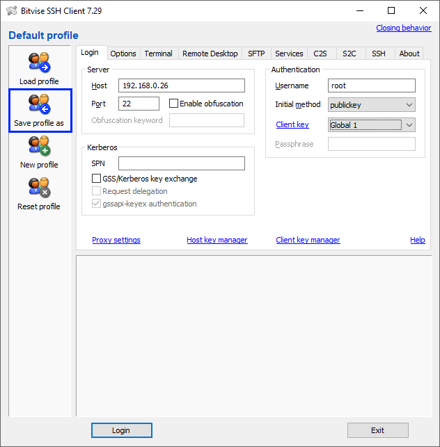

# Tessel 2 & SSH (Windows)

* [Overview](https://bitbucket.org/jxmot/tessel-http-led/overview#markdown-header-overview)
* [Requirements](https://bitbucket.org/jxmot/tessel-http-led/overview#markdown-header-requirements)
* [Connecting to your Tessel 2](https://bitbucket.org/jxmot/tessel-http-led/overview#markdown-header-connecting-to-your-tessel-2)
    * [Instructions](https://bitbucket.org/jxmot/tessel-http-led/overview#markdown-header-instructions)
    * [Additional Notes](https://bitbucket.org/jxmot/tessel-http-led/overview#markdown-header-additional-notes)
* [Toolbox](https://bitbucket.org/jxmot/tessel-http-led/overview#markdown-header-toolbox)
    * [Tessel Environment Versions](https://bitbucket.org/jxmot/tessel-http-led/overview#markdown-header-tessel-environment-versions)
    * [Tools](https://bitbucket.org/jxmot/tessel-http-led/overview#markdown-header-tools)
        * [File Editing](https://bitbucket.org/jxmot/tessel-http-led/overview#markdown-header-file-editing)
        * [Image Editing](https://bitbucket.org/jxmot/tessel-http-led/overview#markdown-header-image-editing)
        * [SSH Client](https://bitbucket.org/jxmot/tessel-http-led/overview#markdown-header-ssh-client)
        * [Version Control](https://bitbucket.org/jxmot/tessel-http-led/overview#markdown-header-version-control)

# Overview

This is a short tutorial on getting an SSH client running on Windows to work with a **Tessel 2**.

# Requirements

Before continuing please read through this tutorial and have - 

* A Tessel 2 - The following *must* be completed before starting this tutorial :
    * You should already have connected your Tessel 2 to your PC and have completed the initialization steps as described in the Tessel 2 documentation(<https://tessel.github.io/t2-start/>).
    * Completed the "blinky" exercise and and have it working.
* An SSH client of your choice successfully installed. I prefer *Bitvise*(<https://www.bitvise.com>), it's full featured and offers a *free* licensing option.
* Located the *key* files that were created when you ran the `t2 provision` command. They are typically located in `C:\Users\USERNAME\.tessel` where `USERNAME` is your current Windows login. For example, if you logged into Windows using "JustAWinUser" then you will find the files in `C:\Users\JustAWinUser\.tessel`.

# Connecting to your Tessel 2

By this point your **Tessel 2** is powered on, initialized, and have confirmed that it's running correctly.

Next we'll need the IP address of your *Tessel 2**. This can be done with this command -

`t2 wifi`

Which should print the following - 

```
INFO Looking for your Tessel...
INFO Connected to Tessel-xxxxxxxxxxxx.
INFO Connected to "YOURSSID"
INFO IP Address: 192.168.0.26
INFO Signal Strength: (70/70)
INFO Bitrate: 48mbps
```

Make note of the IP Address **and** the "`Connected to Tessel-xxxxxxxxxxxx`" information, you will need both in the following steps. For now copy both pieces of information and paste them into a text file that you can use later.

Your *new* text file should contain - 

```
192.168.0.26
Tessel-xxxxxxxxxxxx
```

**NOTE**: Your actual IP address and `Tessel-xxxxxxxxxxxx` name may differ from what is shown above. The `xxxxxxxxxxxx` portion will be the MAC address of your **Tessel 2**. And can be used to identify the specific board you're connected to. You might want to physically label your **Tessel 2**, especially if you have more than one.

## Instructions


**1)** Run your SSH client (*we're using Bitvise*) and you should see this - 


**2)** Enter the IP address of your *Tessel 2* - 


**3)** Change the *Authentication* settings to where *Username* is `root` and the *Initial method* is `publickey`.


**4)** Click on *Host key manager* 


You will see the following dialog box (*this assumes this is your very first use of Bitvise*) - 


**5)** Click on the *Import* button - 


Navigate to `C:\Users\USERNAME\.tessel` where `USERNAME` is your current Windows login and select `id_rsa.pub` and click *Open*. Then - 

* Fill in the *Host* with Tessel's IP address, this was seen when you ran the `ts wifi` command.
* Then in the *Comments* field add `Tessel-xxxxxxxxxxxx`, this was also seen when you ran the `ts wifi` command.


Click the *Import* button after both fields have been filled in. You should see the imported key listed in the *Host Key Manager* - 


Close the dialog box.

**6)** You should have returned to the main *Bitvise* window. Click on *Client key manager* - 


You will see the following dialog box (*this assumes this is your very first use of Bitvise*) - 


**7)** Click on the *Import* button - 


Navigate to `C:\Users\USERNAME\.tessel` where `USERNAME` is your current Windows login and change the file filter to _All Files (\*.\*)_. 


The file `id_rsa` should be visible, select it and click *Open*.

**8)** Then in the resulting dialog box fill in the *Comments* field with `Tessel-xxxxxxxxxxxx`, this was seen when you ran the `ts wifi` command.


Make note of the values in the *Location* fields. You will need to remember this for a subsequent step.

*Be aware that your values may differ from the example.*


Then click the *Import* button and you should see - 


Close the dialog box.

**9)** You should now be back at the main *Bitvise* window. Now change the *Client key* to the location you made note of earlier.


**10)** Save the profile in a convienient location and name it using the `Tessel-xxxxxxxxxxxx` string that was obtained with the `t2 wifi` command.



**11)** Click the *Login* button


Since this is the first login to your **Tessel 2** you may see this dialog, you can safely click *Accept and Save* - 


**NOTE:** On the **first** attempt to log in you *might* get an error. Try again and the second attempt *should be* successful.

When you are logged in you should see a new terminal window - 


## Additional Notes

Here are some additional things to note in regarding the **Tessel 2** and **SSH**.

### Using multiple Tessels and SSH keys

Each time you run the `t2 provision` command you **will overwrite** any previous key files that were located in `C:\Users\USERNAME\.tessel`. If you want to preserve them I recommend that you copy them to a safe and identifiable location prior to any subseqent provision commands.

### Know Linux?

If you're not familiar with *Linux* then be **very** careful when you're poking around in the terminal. 

# Toolbox

I'm running Windows 10 64bit with NodeJS 6.10.2.

## Tessel Environment Versions

* t2-cli: 0.1.8
* t2-firmware: 0.1.0
* Node.js: 6.10.3

## Tools

My favorite development tools that I used were - 

### File Editing

* **Notepad++** : <https://notepad-plus-plus.org/> General editing.
* **Markdown Edit** : <http://markdownedit.com/> Used for editing this README file.

### Image Editing

* **PaintDOTNet** - <https://www.getpaint.net/> Used in creating the images for this document.

### SSH Client

* **Bitvise SSH Client** - <https://www.bitvise.com>

### Version Control

* **Gitkraken** : <https://www.gitkraken.com/>

